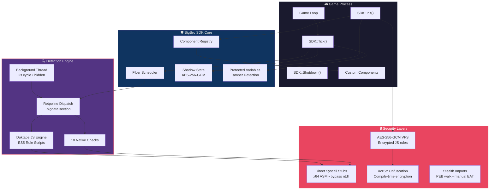
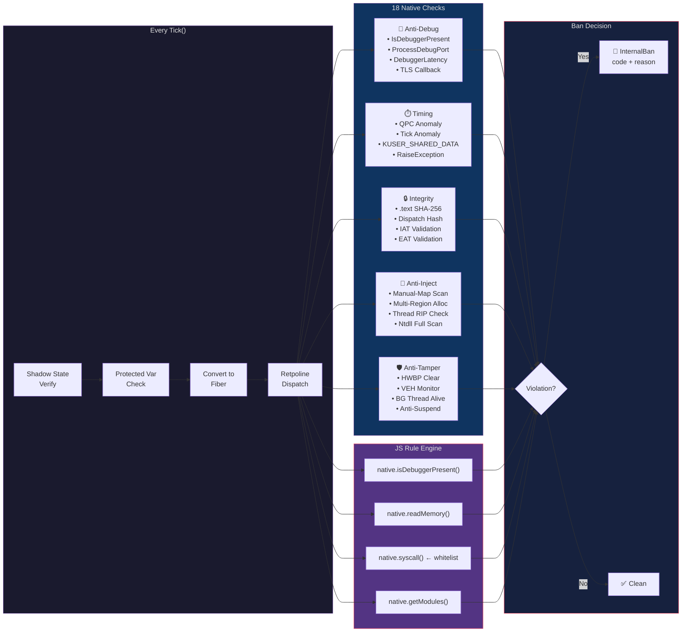
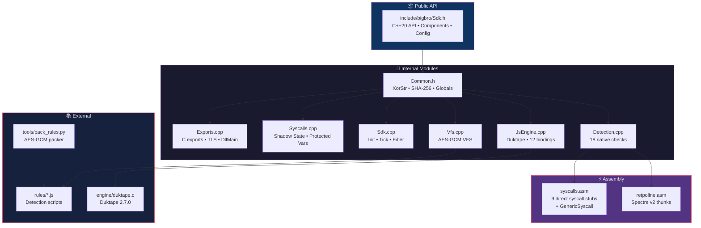

# bigbro.dll

**Open-source anti-cheat SDK for game developers.** C++20. Single DLL. 18 native detections. Fiber-based execution. AES-256-GCM encrypted rule engine.

<p align="center">
    
</p>
---

## Architecture Overview



## Detection Pipeline



## Security Defense Layers

```mermaid
graph LR
    subgraph L1["Layer 1: Early Init"]
        TLS["TLS Callback<br/>Pre-DllMain debug check"]
        LDR["LdrAddRefDll ×100<br/>Anti-unload"]
    end

    subgraph L2["Layer 2: Obfuscation"]
        XOR["XorStr<br/>Compile-time encryption"]
        OBF["Opaque Predicates<br/>Junk branches"]
        RET["Retpoline<br/>Spectre v2 mitigation"]
    end

    subgraph L3["Layer 3: Runtime Integrity"]
        TEXT[".text SHA-256<br/>Code integrity"]
        DISP["Dispatch Table<br/>Hash + Protection"]
        IAT["IAT/EAT<br/>Hook detection"]
    end

    subgraph L4["Layer 4: State Protection"]
        AES["AES-256-GCM<br/>Shadow State"]
        PVAR["Protected Variables<br/>Encrypted shadow copy"]
        WLIST["Syscall Whitelist<br/>JS engine sandboxing"]
    end

    subgraph L5["Layer 5: Continuous Monitor"]
        BGTH["Background Thread<br/>Hidden from debugger"]
        ANTI["Anti-Suspend<br/>Heartbeat watchdog"]
        LIVE["Thread-Alive Check<br/>Kill detection"]
        VEH_M["VEH Chain<br/>Handler monitoring"]
    end

    L1 --> L2 --> L3 --> L4 --> L5

    style L1 fill:#e94560,stroke:#e94560,color:#fff
    style L2 fill:#c23616,stroke:#c23616,color:#fff
    style L3 fill:#533483,stroke:#533483,color:#fff
    style L4 fill:#0f3460,stroke:#0f3460,color:#fff
    style L5 fill:#1a1a2e,stroke:#1a1a2e,color:#e0e0e0
```



## Module Structure



---

## Quick Start

```cpp
#include <bigbro/Sdk.h>

class SpeedHackDetector final : public bigbro::Component {
public:
    const char* GetName() const override { return "MyGame::SpeedHack"; }
    void OnTick() override { /* your detection logic */ }
};

int main() {
    auto& sdk = bigbro::SDK::Get();
    sdk.Components().Register(std::make_shared<SpeedHackDetector>());

    sdk.Init({
        .encryptionKey = "your-key-here",
        .onBan = [](const bigbro::BanEvent& e) {
            printf("BANNED: 0x%X %s\n", e.code, e.reason.c_str());
        },
    });

    int health = 100;
    sdk.ProtectVariable("health", &health, sizeof(health));

    while (running) {
        int result = sdk.Tick();  // 0 = clean, 1 = banned
    }
    sdk.Shutdown();
}
```

## Detection Routines (18 + 3 heavy)

| # | Routine | Code | Category |
|---|---|---|---|
| 1 | `IsDebuggerPresent` | `0xA00A` | Anti-Debug |
| 2 | `DebuggerLatency` | `0xA001` | Timing |
| 3 | `TimingAnomaly` | `0xA002` | Timing |
| 4 | `QPCAnomaly` | `0xA00B` | Timing |
| 5 | `TickAnomaly` | `0xA00C` | Timing |
| 6 | `ThreadsAndHWBP` | `0xA003` | Anti-Debug |
| 7 | `TextIntegrity` | `0xA005` | Integrity |
| 8 | `NtapiHooks` | `0xA006` | Anti-Hook |
| 9 | `BlacklistedWindows` | `0xA007` | Blacklist |
| 10 | `CPUID` | `0xA00D` | VM Detection |
| 11 | `ThreadWatchdog` | — | Monitor |
| 12 | `FiberIntegrity` | `0xA011` | Integrity |
| 13 | `IatHooks` | `0xA012` | Anti-Hook |
| 14 | `EatHooks` | `0xA013` | Anti-Hook |
| 15 | `AntiSuspend` | `0xA01A` | Monitor |
| 16 | `ProcessDebugPort` | `0xA01D` | Anti-Debug |
| 17 | `BgThreadAlive` | `0xA01E` | Monitor |
| 18 | `VehChain` | — | Anti-Inject |

**Heavy checks** (background thread):

| Routine | Code | Description |
|---|---|---|
| `ManualMap` | `0xA018` | MZ/PE header in private executable memory |
| `ManualMap (headerless)` | `0xA01C` | Multi-region allocation with mixed permissions |
| `NtdllFullScan` | `0xA019` | Mass ntdll syscall stub hooking (≥5) |

## Test Coverage

**37/37 passing** — every detection has paired positive + negative tests:

| Category | Count | Description |
|---|---|---|
| SDK Core | 7 | Init, Shutdown, Tick, Components, Registry |
| Security Infra | 6 | XorStr, Retpoline, TLS, Syscalls, Shadow State |
| Protected Vars | 2 | API + tamper detection |
| JS Engine | 4 | Engine, bindings, rule loading, ban propagation |
| Attack Simulation (**ban+**) | 10 | Real attack scenarios that must trigger ban |
| False Positive (**clean**) | 5 | Legitimate scenarios that must NOT trigger ban |
| Syscall Whitelist | 3 | Block dangerous + allow safe + JS bindings |

## Build

```bash
cmake -B build -G "Visual Studio 17 2022" -A x64 \
      -DBIGBRO_PACK_KEY="your-encryption-key"
cmake --build build --config Release

# Run tests
cd build/Release && tester.exe
```

Requires Python 3 + `pycryptodome` for rule encryption.

## License

MIT
