# bigbro.dll

**Open-source anti-cheat SDK for game developers.** C++20. Single DLL. 18 native detections. Fiber-based execution. AES-256-GCM encrypted rule engine. Ordinal-only exports.

<p align="center">
    
</p>
---

## Architecture Overview

```mermaid
graph TB
    subgraph HOST["🎮 Game Process"]
        GAME["Game Loop"]
        LOAD["LoadLibrary + GetProcAddress"]
        ATTEST["DLL Attestation<br/>ECDSA P-256 verify"]
        TICK["BigBro_Tick()"]
    end

    subgraph SDK["🛡️ BigBro SDK Core"]
        direction TB
        CAPI["C API — Ordinal-Only<br/>17 NONAME exports"]
        FIBER["Fiber Scheduler"]
        SHADOW["Shadow State<br/>AES-256-GCM"]
        PROTECTED["Protected Variables<br/>Tamper Detection"]
        REGISTRY["Component Registry"]
        CUSTOM["CustomComponents.cpp<br/>User-defined detections"]
    end

    subgraph DETECT["🔍 Detection Engine"]
        direction TB
        DISPATCH["Retpoline Dispatch<br/>.bigdata section"]
        NATIVE["18 Native Checks"]
        JS["Duktape JS Engine<br/>ES5 Rule Scripts"]
        BG["Background Thread<br/>2s cycle • hidden"]
    end

    subgraph SECURITY["🔒 Security Layers"]
        direction TB
        SYSCALL["Direct Syscall Stubs<br/>x64 ASM • bypass ntdll"]
        VFS["AES-256-GCM VFS<br/>Encrypted JS rules"]
        XORSTR["XorStr Obfuscation<br/>Compile-time encryption"]
        STEALTH["Stealth Imports<br/>PEB walk • manual EAT"]
        ECDSA["DLL Attestation<br/>ECDSA P-256 challenge-response"]
    end

    GAME --> LOAD
    LOAD --> ATTEST
    ATTEST --> TICK
    TICK --> CAPI --> FIBER
    FIBER --> DISPATCH
    DISPATCH --> NATIVE
    DISPATCH --> JS
    CAPI --> SHADOW
    CAPI --> PROTECTED
    REGISTRY --> CUSTOM
    NATIVE --> SYSCALL
    JS --> SYSCALL
    BG --> DISPATCH
    VFS --> XORSTR

    style HOST fill:#1a1a2e,stroke:#16213e,color:#e0e0e0
    style SDK fill:#0f3460,stroke:#533483,color:#e0e0e0
    style DETECT fill:#533483,stroke:#e94560,color:#e0e0e0
    style SECURITY fill:#e94560,stroke:#e94560,color:#fff
```



## Detection Pipeline

```mermaid
flowchart LR
    subgraph TICK["Every Tick()"]
        direction TB
        A["Shadow State<br/>Verify"] --> B["Protected Var<br/>Check"]
        B --> C["Convert to<br/>Fiber"]
        C --> D["Retpoline<br/>Dispatch"]
    end

    subgraph NATIVE["18 Native Checks"]
        direction TB
        D1["🐛 Anti-Debug<br/>• IsDebuggerPresent<br/>• ProcessDebugPort<br/>• DebuggerLatency<br/>• TLS Callback"]
        D2["⏱️ Timing<br/>• QPC Anomaly<br/>• Tick Anomaly<br/>• KUSER_SHARED_DATA<br/>• RaiseException"]
        D3["🔒 Integrity<br/>• .text SHA-256<br/>• Dispatch Hash<br/>• IAT Validation<br/>• EAT Validation"]
        D4["💉 Anti-Inject<br/>• Manual-Map Scan<br/>• Multi-Region Alloc<br/>• Thread RIP Check<br/>• Ntdll Full Scan"]
        D5["🛡️ Anti-Tamper<br/>• HWBP Clear<br/>• VEH Monitor<br/>• BG Thread Alive<br/>• Anti-Suspend"]
    end

    subgraph JS["JS Rule Engine"]
        direction TB
        J1["native.isDebuggerPresent()"]
        J2["native.readMemory()"]
        J3["native.syscall() ← whitelist"]
        J4["native.getModules()"]
    end

    subgraph BAN["Ban Decision"]
        B1{"Violation?"}
        B2["🚫 InternalBan<br/>code + reason"]
        B3["✅ Clean"]
    end

    D --> D1 & D2 & D3 & D4 & D5
    D --> J1 & J2 & J3 & J4
    D1 & D2 & D3 & D4 & D5 --> B1
    J1 & J2 & J3 & J4 --> B1
    B1 -->|Yes| B2
    B1 -->|No| B3

    style TICK fill:#1a1a2e,stroke:#533483,color:#e0e0e0
    style NATIVE fill:#0f3460,stroke:#533483,color:#e0e0e0
    style JS fill:#533483,stroke:#e94560,color:#e0e0e0
    style BAN fill:#16213e,stroke:#e94560,color:#e0e0e0
```



## Security Defense Layers

```mermaid
graph LR
    subgraph L1["Layer 1: Early Init"]
        TLS["TLS Callback<br/>Pre-DllMain debug check"]
        LDR["LdrAddRefDll ×100<br/>Anti-unload"]
    end

    subgraph L2["Layer 2: Obfuscation"]
        XOR["XorStr<br/>Compile-time encryption"]
        OBF["Opaque Predicates<br/>Junk branches"]
        RET["Retpoline<br/>Spectre v2 mitigation"]
        CFG["CFG<br/>Control Flow Guard"]
        NONAME["NONAME Exports<br/>Zero symbol names in PE"]
    end

    subgraph L3["Layer 3: Runtime Integrity"]
        TEXT[".text SHA-256<br/>Code integrity"]
        DISP["Dispatch Table<br/>Hash + Protection"]
        IAT["IAT/EAT<br/>Hook detection"]
        ATT["ECDSA P-256<br/>DLL attestation"]
    end

    subgraph L4["Layer 4: State Protection"]
        AES["AES-256-GCM<br/>Shadow State"]
        PVAR["Protected Variables<br/>Encrypted shadow copy"]
        WLIST["Syscall Whitelist<br/>JS engine sandboxing"]
    end

    subgraph L5["Layer 5: Continuous Monitor"]
        BGTH["Background Thread<br/>Hidden from debugger"]
        ANTI["Anti-Suspend<br/>Heartbeat watchdog"]
        LIVE["Thread-Alive Check<br/>Kill detection"]
        VEH_M["VEH Chain<br/>Handler monitoring"]
    end

    L1 --> L2 --> L3 --> L4 --> L5

    style L1 fill:#e94560,stroke:#e94560,color:#fff
    style L2 fill:#c23616,stroke:#c23616,color:#fff
    style L3 fill:#533483,stroke:#533483,color:#fff
    style L4 fill:#0f3460,stroke:#0f3460,color:#fff
    style L5 fill:#1a1a2e,stroke:#1a1a2e,color:#e0e0e0
```



## Module Structure

```mermaid
graph TD
    subgraph PUBLIC["📦 Public API — Ordinal Only"]
        SDK_H["include/bigbro/Sdk.h<br/>C API declarations"]
        PUBKEY["attestation_pubkey.h<br/>ECDSA public key"]
    end

    subgraph INTERNAL["🔧 Internal Modules"]
        COMMON["Common.h<br/>XorStr • SHA-256 • Globals"]
        DET["Detection.cpp<br/>18 native checks"]
        JSENG["JsEngine.cpp<br/>Duktape • 12 bindings"]
        VFS_M["Vfs.cpp<br/>AES-GCM VFS"]
        SDKC["Sdk.cpp<br/>Init • Tick • Fiber"]
        SYSC["Syscalls.cpp<br/>Shadow State • Protected Vars"]
        EXP["Exports.cpp<br/>C API wrappers • TLS • DllMain"]
        ATT["Attestation.cpp<br/>ECDSA P-256 signing"]
        CUST["CustomComponents.cpp<br/>User-defined detections"]
    end

    subgraph ASM["⚡ Assembly"]
        RETPO["retpoline.asm<br/>Spectre v2 thunks"]
        SYSCA["syscalls.asm<br/>9 direct syscall stubs<br/>+ GenericSyscall"]
    end

    subgraph EXTERN["📚 External"]
        DUK["engine/duktape.c<br/>Duktape 2.7.0"]
        RULES["rules/*.js<br/>Detection scripts"]
        PACK["tools/pack_rules.py<br/>AES-GCM packer"]
        KEYGEN["tools/gen_attestation_key.py<br/>ECDSA keypair generator"]
    end

    SDK_H --> COMMON
    COMMON --> DET & JSENG & VFS_M & SDKC & SYSC & EXP & ATT
    DET --> RETPO & SYSCA
    JSENG --> DUK
    VFS_M --> RULES
    PACK --> RULES
    KEYGEN --> ATT

    style PUBLIC fill:#0f3460,stroke:#533483,color:#e0e0e0
    style INTERNAL fill:#1a1a2e,stroke:#533483,color:#e0e0e0
    style ASM fill:#533483,stroke:#e94560,color:#e0e0e0
    style EXTERN fill:#16213e,stroke:#e94560,color:#e0e0e0
```



---

## Quick Start

The DLL exports **only ordinal numbers** — no C++ symbols. Load at runtime:

```cpp
#include <windows.h>
#include <cstdio>
#include "bigbro/attestation_pubkey.h"

// Function pointer types
typedef void (*SetBanCb_t)(void(*)(uint32_t, const char*));
typedef int  (*Init_t)(uint32_t, const char*, const char*);
typedef int  (*Tick_t)();
typedef void (*Shutdown_t)();
typedef int  (*Challenge_t)(const uint8_t*, uint32_t, uint8_t*, uint32_t);

void OnBan(uint32_t code, const char* reason) {
    printf("BANNED: 0x%X %s\n", code, reason);
}

int main() {
    HMODULE hDll = LoadLibraryA("bigbro.dll");

    // Resolve by ordinal
    auto SetBanCb = (SetBanCb_t) GetProcAddress(hDll, MAKEINTRESOURCEA(12));
    auto Init     = (Init_t)     GetProcAddress(hDll, MAKEINTRESOURCEA(7));
    auto Tick     = (Tick_t)     GetProcAddress(hDll, MAKEINTRESOURCEA(8));
    auto Shutdown = (Shutdown_t) GetProcAddress(hDll, MAKEINTRESOURCEA(9));

    SetBanCb(OnBan);
    Init(0, "your-key-here", nullptr);

    int health = 100;
    auto Protect = (void(*)(const char*, const void*, uint32_t))
        GetProcAddress(hDll, MAKEINTRESOURCEA(14));
    Protect("health", &health, sizeof(health));

    while (running) {
        int result = Tick();  // 0 = clean, 1 = banned
    }
    Shutdown();
    FreeLibrary(hDll);
}
```

### Custom Components

Since the DLL has no C++ exports, custom detection components are compiled into the DLL from source. Edit `src/CustomComponents.cpp`:

```cpp
class SpeedHackDetector final : public bigbro::Component {
public:
    const char* GetName() const override { return "MyGame::SpeedHack"; }
    void OnTick() override { /* your detection logic */ }
};

void RegisterCustomComponents(bigbro::ComponentRegistry& registry) {
    registry.Register(std::make_shared<SpeedHackDetector>());
}
```

## C API Ordinal Map

| Ordinal | Function | Description |
|---------|----------|-------------|
| @1 | `RunFullSuite` | Legacy: init + tick |
| @2 | `IsUserBanned` | Legacy: ban check |
| @3 | `TriggerSelfTamper` | Testing: trigger tamper |
| @4 | `StartBackgroundDetection` | Start bg thread |
| @5 | `RunHeavyChecksExport` | Manual-map + ntdll scans |
| @6 | `GetBgThreadId` | Get bg thread ID |
| @7 | **`BigBro_Init`** | Init with flags/key/rules |
| @8 | **`BigBro_Tick`** | Run detection cycle |
| @9 | **`BigBro_Shutdown`** | Cleanup |
| @10 | **`BigBro_IsBanned`** | Ban status |
| @11 | **`BigBro_LoadRule`** | Load JS rule file |
| @12 | **`BigBro_SetBanCallback`** | Set ban callback |
| @13 | **`BigBro_SetLogCallback`** | Set log callback |
| @14 | **`BigBro_ProtectVariable`** | Register protected var |
| @15 | **`BigBro_UnprotectVariable`** | Remove protected var |
| @16 | **`BigBro_UpdateProtectedVariable`** | Sync shadow copy |
| @17 | **`BigBro_Challenge`** | ECDSA P-256 attestation |

## DLL Attestation (ECDSA P-256)

Prevents DLL swapping on disk. Host verifies the loaded DLL is genuine:

```
Host                           bigbro.dll
  |-- random nonce ----------->|
  |                            | sign(SHA256(nonce), private_key)
  |<-- ECDSA signature --------|
  | verify(signature, pubkey)
  | PASS = genuine ✅
  | FAIL = swapped ❌
```

Regenerate keypair: `python tools/gen_attestation_key.py src/attestation_key.gen.h include/bigbro/attestation_pubkey.h`

## Detection Routines (18 + 3 heavy)

| # | Routine | Code | Category |
|---|---|---|---|
| 1 | `IsDebuggerPresent` | `0xA00A` | Anti-Debug |
| 2 | `DebuggerLatency` | `0xA001` | Timing |
| 3 | `TimingAnomaly` | `0xA002` | Timing |
| 4 | `QPCAnomaly` | `0xA00B` | Timing |
| 5 | `TickAnomaly` | `0xA00C` | Timing |
| 6 | `ThreadsAndHWBP` | `0xA003` | Anti-Debug |
| 7 | `TextIntegrity` | `0xA005` | Integrity |
| 8 | `NtapiHooks` | `0xA006` | Anti-Hook |
| 9 | `BlacklistedWindows` | `0xA007` | Blacklist |
| 10 | `CPUID` | `0xA00D` | VM Detection |
| 11 | `ThreadWatchdog` | — | Monitor |
| 12 | `FiberIntegrity` | `0xA011` | Integrity |
| 13 | `IatHooks` | `0xA012` | Anti-Hook |
| 14 | `EatHooks` | `0xA013` | Anti-Hook |
| 15 | `AntiSuspend` | `0xA01A` | Monitor |
| 16 | `ProcessDebugPort` | `0xA01D` | Anti-Debug |
| 17 | `BgThreadAlive` | `0xA01E` | Monitor |
| 18 | `VehChain` | — | Anti-Inject |

**Heavy checks** (background thread):

| Routine | Code | Description |
|---|---|---|
| `ManualMap` | `0xA018` | MZ/PE header in private executable memory |
| `ManualMap (headerless)` | `0xA01C` | Multi-region allocation with mixed permissions |
| `NtdllFullScan` | `0xA019` | Mass ntdll syscall stub hooking (≥5) |

## Test Coverage

**38/38 passing** — every detection has paired positive + negative tests:

| Category | Count | Description |
|---|---|---|
| SDK Core | 7 | Init, Shutdown, Tick, Exports, C API |
| Security Infra | 6 | XorStr, Retpoline, TLS, Syscalls, Shadow State |
| DLL Attestation | 2 | Genuine DLL pass + tampered signature fail |
| Protected Vars | 2 | API + tamper detection |
| JS Engine | 4 | Engine, bindings, rule loading, ban propagation |
| Attack Simulation (**ban+**) | 10 | Real attack scenarios that must trigger ban |
| False Positive (**clean**) | 5 | Legitimate scenarios that must NOT trigger ban |
| Syscall Whitelist | 2 | Block dangerous + allow safe |

## Build

```bash
cmake -B build -G "Visual Studio 18 2026" -A x64 \
      -DBIGBRO_PACK_KEY="your-encryption-key"
cmake --build build --config Release

# Run tests
cd build/Release && tester.exe
```

Requires Python 3 + `pycryptodome` for rule encryption.

Regenerate attestation keys: `python tools/gen_attestation_key.py src/attestation_key.gen.h include/bigbro/attestation_pubkey.h` (requires `pip install cryptography`).

## License

MIT
